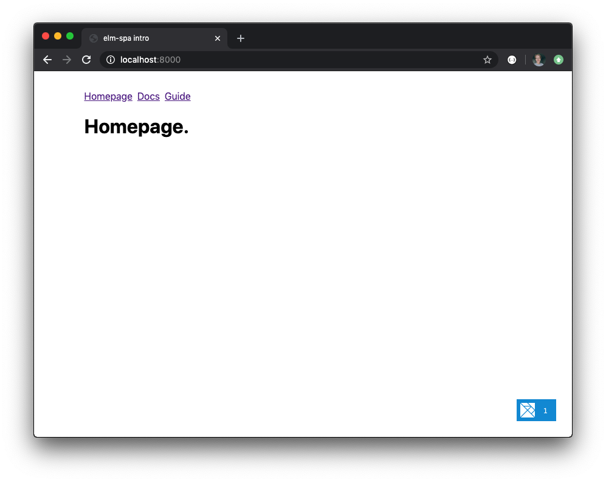

# elm-spa intro example
> available at https://elm-spa-intro.netlify.com



an example of using the `ryannhg/elm-spa` package __without the CLI tool__. This is just is just the Elm package.

This example uses [elm-live](elm-live.com), so that single page routing works as intended.

### try it out!

```bash
npm start
```
